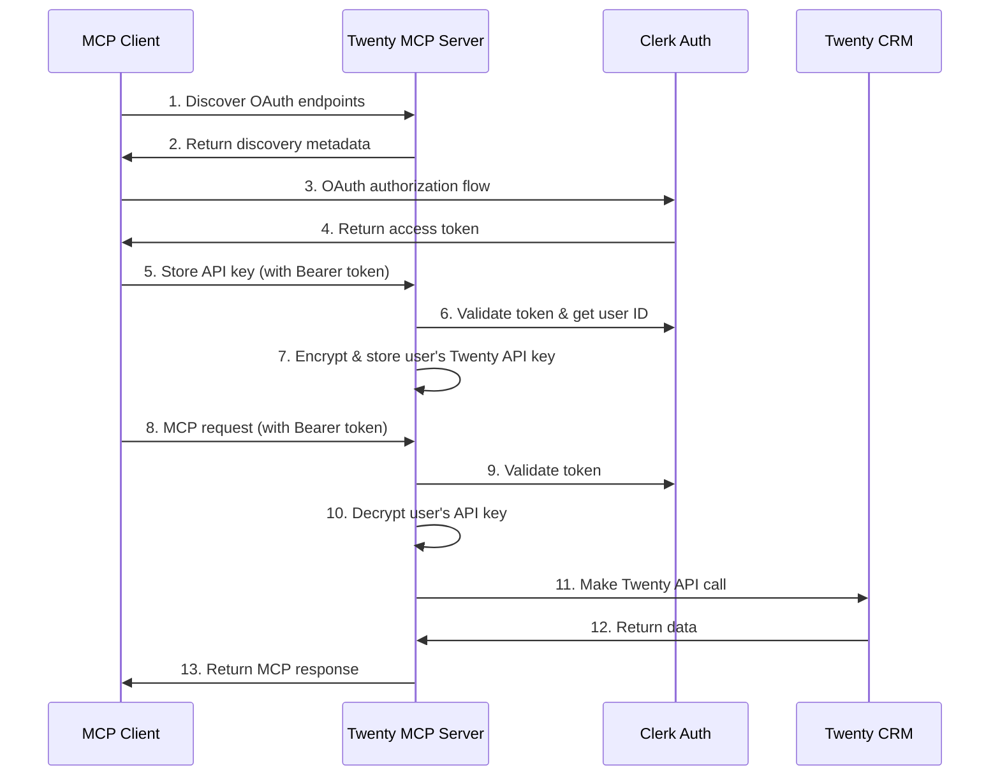

# OAuth 2.1 Authentication Guide

This guide covers the OAuth 2.1 authentication implementation for the Twenty MCP Server, following the [MCP Authentication Specification](https://modelcontextprotocol.io/specification/2025-06-18/basic/index#auth).

## Table of Contents

- [Quick Start](#quick-start)
- [Architecture Overview](#architecture-overview)
- [Setup and Configuration](#setup-and-configuration)
- [OAuth Flow](#oauth-flow)
- [API Endpoints](#api-endpoints)
- [Client Integration](#client-integration)
- [Security Considerations](#security-considerations)
- [Troubleshooting](#troubleshooting)

## Quick Start

### 1. Run OAuth Setup CLI

```bash
npm run setup:oauth
```

This interactive CLI will guide you through:
- Enabling OAuth authentication
- Configuring Clerk credentials
- Setting up encryption
- Configuring default API keys

### 2. Start the Server

```bash
npm start
```

### 3. Test OAuth Discovery

```bash
# Check OAuth protected resource metadata
curl http://localhost:3000/.well-known/oauth-protected-resource

# Check authorization server metadata
curl http://localhost:3000/.well-known/oauth-authorization-server
```

## Architecture Overview



## Setup and Configuration

### Environment Variables

| Variable | Required | Description |
|----------|----------|-------------|
| `AUTH_ENABLED` | No | Enable OAuth authentication (default: false) |
| `REQUIRE_AUTH` | No | Require auth for all requests (default: false) |
| `AUTH_PROVIDER` | No | Auth provider (currently only 'clerk') |
| `CLERK_PUBLISHABLE_KEY` | If auth enabled | Clerk publishable key |
| `CLERK_SECRET_KEY` | If auth enabled | Clerk secret key |
| `CLERK_DOMAIN` | If auth enabled | Clerk domain (auto-detected if not set) |
| `API_KEY_ENCRYPTION_SECRET` | If auth enabled | 32+ character secret for encrypting API keys |
| `TWENTY_API_KEY` | No | Global Twenty API key (fallback) |
| `TWENTY_BASE_URL` | No | Twenty CRM base URL (default: https://api.twenty.com) |

### Manual Configuration

Create a `.env` file:

```env
# OAuth Configuration
AUTH_ENABLED=true
REQUIRE_AUTH=false
AUTH_PROVIDER=clerk

# Clerk Configuration
CLERK_PUBLISHABLE_KEY=pk_test_...
CLERK_SECRET_KEY=sk_test_...
CLERK_DOMAIN=your-app.clerk.accounts.dev

# Security
API_KEY_ENCRYPTION_SECRET=your-32-byte-hex-string-here

# Optional: Global Twenty API Key
TWENTY_API_KEY=your-twenty-api-key
TWENTY_BASE_URL=https://api.twenty.com
```

## OAuth Flow

### 1. Discovery Phase

MCP clients discover OAuth capabilities by calling:

```http
GET /.well-known/oauth-protected-resource
```

Response:
```json
{
  "resource": "http://localhost:3000",
  "authorization_servers": ["https://your-app.clerk.accounts.dev"],
  "bearer_methods_supported": ["header"],
  "scopes_supported": ["twenty:read", "twenty:write"]
}
```

### 2. Authorization Server Discovery

```http
GET /.well-known/oauth-authorization-server
```

Response:
```json
{
  "issuer": "https://your-app.clerk.accounts.dev",
  "authorization_endpoint": "https://your-app.clerk.accounts.dev/oauth/authorize",
  "token_endpoint": "https://your-app.clerk.accounts.dev/oauth/token",
  "response_types_supported": ["code"],
  "grant_types_supported": ["authorization_code", "refresh_token"],
  "code_challenge_methods_supported": ["S256"]
}
```

### 3. User Authorization

Client redirects user to Clerk's authorization endpoint:

```
https://your-app.clerk.accounts.dev/oauth/authorize
  ?response_type=code
  &client_id=YOUR_CLIENT_ID
  &redirect_uri=YOUR_REDIRECT_URI
  &scope=twenty:read+twenty:write
  &code_challenge=CHALLENGE
  &code_challenge_method=S256
```

### 4. Token Exchange

Client exchanges authorization code for access token:

```http
POST https://your-app.clerk.accounts.dev/oauth/token
Content-Type: application/x-www-form-urlencoded

grant_type=authorization_code
&code=AUTHORIZATION_CODE
&client_id=YOUR_CLIENT_ID
&code_verifier=VERIFIER
&redirect_uri=YOUR_REDIRECT_URI
```

### 5. API Key Configuration

Store user's Twenty API key (one-time setup):

```http
POST /api/keys
Authorization: Bearer ACCESS_TOKEN
Content-Type: application/json

{
  "apiKey": "user-twenty-api-key",
  "baseUrl": "https://api.twenty.com"
}
```

### 6. Authenticated MCP Requests

Make MCP requests with Bearer token:

```http
POST /mcp
Authorization: Bearer ACCESS_TOKEN
Content-Type: application/json

{
  "jsonrpc": "2.0",
  "method": "initialize",
  "params": {},
  "id": 1
}
```

## API Endpoints

### Health Check

```http
GET /health
```

Returns server status and auth configuration.

### OAuth Discovery

- `GET /.well-known/oauth-protected-resource` - Protected resource metadata
- `GET /.well-known/oauth-authorization-server` - Authorization server metadata

### API Key Management

All endpoints require valid Bearer token.

#### Get API Key Metadata

```http
GET /api/keys
Authorization: Bearer TOKEN
```

Response:
```json
{
  "hasKey": true,
  "updatedAt": "2024-01-01T00:00:00Z",
  "baseUrl": "https://api.twenty.com"
}
```

#### Store API Key

```http
POST /api/keys
Authorization: Bearer TOKEN
Content-Type: application/json

{
  "apiKey": "your-twenty-api-key",
  "baseUrl": "https://api.twenty.com"
}
```

#### Delete API Key

```http
DELETE /api/keys
Authorization: Bearer TOKEN
```

### MCP Endpoint

```http
POST /mcp[?apiKey=key]
Authorization: Bearer TOKEN (if auth enabled)
Content-Type: application/json

{
  "jsonrpc": "2.0",
  "method": "method_name",
  "params": {},
  "id": 1
}
```

## Client Integration

### MCP Client Example

```typescript
import { Client } from '@modelcontextprotocol/sdk/client/index.js';

// 1. Discover OAuth endpoints
const discovery = await fetch('http://localhost:3000/.well-known/oauth-protected-resource');
const metadata = await discovery.json();

// 2. Perform OAuth flow (implementation depends on client)
const accessToken = await performOAuthFlow(metadata.authorization_servers[0]);

// 3. Configure API key (one-time)
await fetch('http://localhost:3000/api/keys', {
  method: 'POST',
  headers: {
    'Authorization': `Bearer ${accessToken}`,
    'Content-Type': 'application/json',
  },
  body: JSON.stringify({
    apiKey: 'user-twenty-api-key',
    baseUrl: 'https://api.twenty.com'
  })
});

// 4. Create authenticated MCP client
const client = new Client({
  name: 'my-client',
  version: '1.0.0'
}, {
  capabilities: {}
});

// 5. Connect with Bearer token
await client.connect(transport, {
  headers: {
    'Authorization': `Bearer ${accessToken}`
  }
});
```

### Backward Compatibility

The server maintains backward compatibility with non-authenticated requests:

```typescript
// Works when AUTH_ENABLED=false or REQUIRE_AUTH=false
const url = 'http://localhost:3000/mcp?apiKey=your-api-key';
await client.connect(httpTransport(url));
```

## Security Considerations

### API Key Encryption

- User API keys are encrypted using AES-256-GCM
- Unique initialization vector (IV) for each encryption
- Authentication tags prevent tampering
- Keys are stored in Clerk's secure `privateMetadata`

### Token Validation

- Bearer tokens are validated with Clerk on every request
- Session status checked for active sessions
- JWT signatures verified
- Tokens cached briefly to reduce Clerk API calls

### Transport Security

- HTTPS required in production
- CORS headers configured for cross-origin requests
- Secure HTTP headers recommended

### Environment Security

```bash
# Secure environment variables
chmod 600 .env

# Use strong encryption secret
openssl rand -hex 32
```

## Troubleshooting

### Common Issues

#### Authentication Failed

```
Error: Authentication failed - mock token not accepted
```

**Solution**: Use real Clerk tokens, not mock tokens.

#### Missing API Key

```
Error: No API key configured
```

**Solution**: Configure API key via `/api/keys` endpoint after authentication.

#### Encryption Secret Missing

```
Error: API_KEY_ENCRYPTION_SECRET environment variable is required
```

**Solution**: Set a 32+ character encryption secret in environment variables.

#### CORS Issues

```
Error: CORS policy blocked request
```

**Solution**: Server includes CORS headers, but check client configuration.

### Debug Mode

Enable debug logging:

```env
DEBUG=clerk:*
NODE_ENV=development
```

### Health Check

```bash
curl http://localhost:3000/health
```

Should return:
```json
{
  "status": "healthy",
  "service": "twenty-mcp-server",
  "authEnabled": true
}
```

### Test OAuth Discovery

```bash
# Test protected resource metadata
curl -v http://localhost:3000/.well-known/oauth-protected-resource

# Should return 200 OK when auth is enabled
# Should return 404 when auth is disabled
```

### Validate Clerk Configuration

```bash
# Test with real Clerk token
export ACCESS_TOKEN="your-clerk-token"

curl -H "Authorization: Bearer $ACCESS_TOKEN" \
     http://localhost:3000/api/keys
```

## Migration Guide

### From Non-Authenticated Setup

1. **Backup existing configuration**:
   ```bash
   cp .env .env.backup
   ```

2. **Run OAuth setup**:
   ```bash
   npm run setup:oauth
   ```

3. **Test backward compatibility**:
   ```bash
   # Should still work
   curl "http://localhost:3000/mcp?apiKey=your-key"
   ```

4. **Enable required auth** (optional):
   ```env
   REQUIRE_AUTH=true
   ```

### From Development to Production

1. **Update Clerk keys** from test to live:
   ```env
   CLERK_PUBLISHABLE_KEY=pk_live_...
   CLERK_SECRET_KEY=sk_live_...
   ```

2. **Use strong encryption secret**:
   ```bash
   openssl rand -hex 32
   ```

3. **Enable HTTPS** and update server URL:
   ```env
   MCP_SERVER_URL=https://your-domain.com
   ```

4. **Review security headers** in production deployment.

## Support

- **Issues**: [GitHub Issues](https://github.com/jezweb/twenty-mcp/issues)
- **Discussions**: [GitHub Discussions](https://github.com/jezweb/twenty-mcp/discussions)
- **MCP Spec**: [Model Context Protocol](https://modelcontextprotocol.io/)
- **Clerk Docs**: [Clerk Documentation](https://clerk.com/docs)